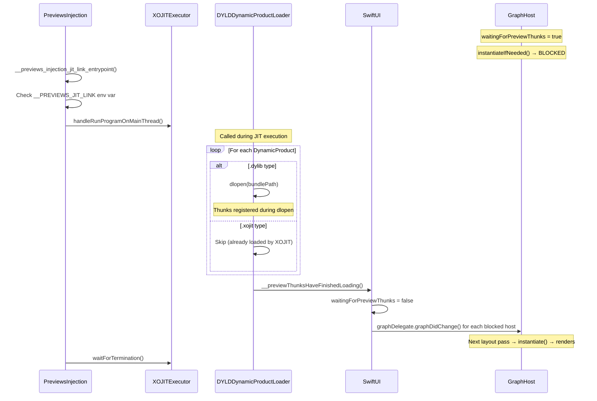

# Preview Support

## Current Status

OpenSwiftUI supports Xcode Preview rendering as of [PR #829](https://github.com/OpenSwiftUIProject/OpenSwiftUI/pull/829).

### How It Works

Since OpenSwiftUI cannot use SwiftUI's `#Preview` macro directly (it targets `SwiftUI.View`), we use a **shim-based approach**:

1. A `_previewVC()` helper wraps an `OpenSwiftUI.View` in a platform hosting controller (`UIHostingController` / `NSHostingController`)
2. The hosting controller (a `UIViewController` / `NSViewController`) is returned to SwiftUI's `#Preview` macro

```swift
#Preview("HostingVC") {
    ContentView()._previewVC()
}
```

For `CAHostingLayer`-based previews:

```swift
#Preview("CAHostingLayerExample") {
    CAHostingLayerExample(
        content: ContentView(),
        size: UIScreen.main.bounds.size
    ).makeViewController()
}
```

### The `waitingForPreviewThunks` Problem

In Xcode Preview mode, SwiftUI gates graph instantiation behind a `waitingForPreviewThunks` flag (checked via `XCODE_RUNNING_FOR_PREVIEWS` env var). After all preview dylibs are loaded, `PreviewsInjection.framework` calls `SwiftUI.__previewThunksHaveFinishedLoading()` to unblock graph hosts.

**The problem**: `PreviewsInjection` calls SwiftUI's version via a **library-specific GOT binding** (two-level namespace). OpenSwiftUI's version is never called, causing graph instantiation to block indefinitely and producing an empty display list.

**Current fix**: `waitingForPreviewThunks` is hardcoded to `false`, bypassing the blocking entirely. This is semantically correct because OpenSwiftUI has no preview thunk producers today.

## PreviewsInjection Sequence



## Future Plan

The current shim-based approach is a temporary bridge. The long-term goal is for OpenSwiftUI to have its **own** native preview support:

### Phase 1: Own `#Preview` Macro
- Implement OpenSwiftUI's own `#Preview` macro that targets `OpenSwiftUI.View` directly
- Eliminate the need for `_previewVC()` shims and hosting controller wrappers
- Users would write `#Preview { MyView() }` with OpenSwiftUI views directly

### Phase 2: Own Preview Thunk Registration
- Implement an independent preview thunk registration system
- Re-enable `waitingForPreviewThunks` with OpenSwiftUI's own unblocking mechanism
- Decouple entirely from `PreviewsInjection.framework`'s SwiftUI-specific GOT binding

### Phase 3: Non-Apple Preview Host
- Build a standalone preview host that works outside Xcode
- Enable live previews on Linux/Windows where Xcode is not available
- Support hot-reload workflows independent of Apple's preview infrastructure
