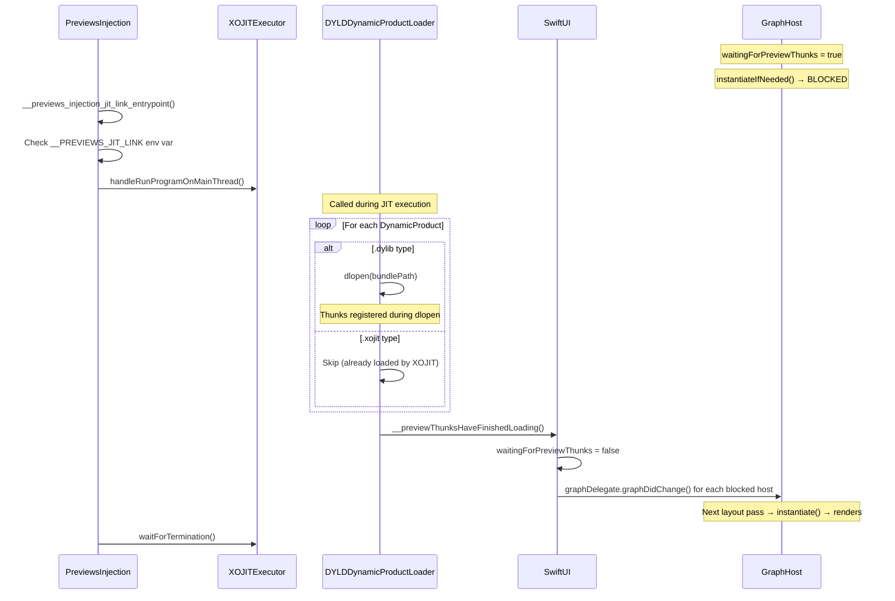

# Preview Support

## Current Status

[PR #1018](https://github.com/OpenSwiftUIProject/OpenSwiftUI/pull/1018) adds an OpenSwiftUI-specific `#Preview` overload, building on the hosting-controller shim from [PR #829](https://github.com/OpenSwiftUIProject/OpenSwiftUI/pull/829) and macOS binary support from [PR #952](https://github.com/OpenSwiftUIProject/OpenSwiftUI/pull/952). Binary distributions also require the framework linkage and host-side macro setup described below.

### How It Works

OpenSwiftUI declares a `Preview` macro overload whose view builder produces `OpenSwiftUI.View`. UIKit and AppKit continue to provide the controller-oriented Preview overloads. When these modules are imported together, Swift selects the matching macro from the type produced by the body:

1. `#Preview` with an `OpenSwiftUI.View` body resolves to OpenSwiftUI's macro and collects the content in a `Group`
2. `_previewVC()` wraps that content in `NSHostingController` or `UIHostingController`
3. The expansion emits the `DeveloperToolsSupport.PreviewRegistry` that Xcode discovers and returns a preview containing the resulting controller

```swift
import AppKit
import OpenSwiftUI

#Preview("OpenSwiftUI View") {
    ContentView()
}

#Preview("View Controller") {
    NSViewController()
}
```

The first declaration uses OpenSwiftUI's Preview macro because its body produces an `OpenSwiftUI.View`. The second continues to use AppKit's Preview macro because its body produces an `NSViewController`. The same overload selection applies to UIKit and `UIViewController`; these common cases do not require explicit module qualification.

Native macOS targets return an `NSViewController`; iOS, Mac Catalyst, and visionOS targets return a `UIViewController`. The current hosting-controller path does not support tvOS or watchOS because OpenSwiftUI does not provide a hosting controller on those platforms.

The macro accepts the same `traits:` and additional trait arguments as SwiftUI's view Preview macro.

### Binary XCFramework Requirements

`OpenSwiftUIMacros` runs on the build host, so it cannot be shipped inside a target-platform XCFramework.

`OpenSwiftUI-spm` mirrors the matching macro sources and includes the target in its `OpenSwiftUI` product. SwiftPM builds and loads the host plugin, preserving the same `#Preview` interface for source and binary consumers.

`OpenSwiftUI-spm` also exposes `OpenSwiftUIMacros` as a separate product. Integrations that model macro products separately, including the Tuist Example, must add it as an explicit macro dependency alongside `OpenSwiftUI`. Macro-enabled releases require Xcode 26.6, Swift 6.3, or a compatible toolchain.

Xcode Preview's XOJIT loading model requires both `OpenSwiftUI.framework` and `OpenSwiftUICore.framework` to be dynamic. Packaging `OpenSwiftUICore` as a static framework allows Preview to relink another copy of Core into the preview product, which can duplicate runtime metadata and crash the Preview process.

Link `OpenSwiftUICore` with `-ObjC` when building the framework so Objective-C categories from the static `OpenSwiftUI_SPI` dependency are retained in the Core dylib. This is a framework-build setting; consumers of the resulting XCFrameworks do not need to add `-ObjC`.

Consumers that integrate the XCFrameworks directly instead of using `OpenSwiftUI-spm` must provide the matching macro plugin separately. Without it, they can still wrap the view with `_previewVC()` explicitly so overload resolution selects the platform Preview macro. For example, on macOS:

```swift
import AppKit
import OpenSwiftUI

#Preview("HostingVC") {
    ContentView()._previewVC()
}
```

### The `waitingForPreviewThunks` Problem

In Xcode Preview mode, SwiftUI gates graph instantiation behind a `waitingForPreviewThunks` flag (checked via `XCODE_RUNNING_FOR_PREVIEWS` env var). After all preview dylibs are loaded, `PreviewsInjection.framework` calls `SwiftUI.__previewThunksHaveFinishedLoading()` to unblock graph hosts.

**The problem**: `PreviewsInjection` calls SwiftUI's version via a **library-specific GOT binding** (two-level namespace). OpenSwiftUI's version is never called, causing graph instantiation to block indefinitely and producing an empty display list.

**Current fix**: `waitingForPreviewThunks` is hardcoded to `false`, bypassing the blocking entirely. This is semantically correct because OpenSwiftUI has no preview thunk producers today.

## SwiftUI PreviewsInjection Reference Sequence

The following sequence describes SwiftUI's reference path. OpenSwiftUI currently bypasses the initial wait as described above.


```mermaid
sequenceDiagram
    participant PI as PreviewsInjection
    participant XOJIT as XOJITExecutor
    participant DPL as DYLDDynamicProductLoader
    participant SUI as SwiftUI
    participant GH as GraphHost

    Note over GH: waitingForPreviewThunks = true
    Note over GH: instantiateIfNeeded() → BLOCKED

    PI->>PI: __previews_injection_jit_link_entrypoint()
    PI->>PI: Check __PREVIEWS_JIT_LINK env var
    PI->>XOJIT: handleRunProgramOnMainThread()

    Note over DPL: Called during JIT execution
    loop For each DynamicProduct
        alt .dylib type
            DPL->>DPL: dlopen(bundlePath)
            Note over DPL: Thunks registered during dlopen
        else .xojit type
            DPL->>DPL: Skip (already loaded by XOJIT)
        end
    end

    DPL->>SUI: __previewThunksHaveFinishedLoading()
    SUI->>SUI: waitingForPreviewThunks = false
    SUI->>GH: graphDelegate.graphDidChange() for each blocked host
    Note over GH: Next layout pass → instantiate() → renders

    PI->>XOJIT: waitForTermination()
```

## Future Plan

The current shim-based approach is a temporary bridge. The long-term goal is for OpenSwiftUI to have its **own** native preview support:

### Phase 1: Native OpenSwiftUI Preview Expansion
- Replace the current hosting-controller registry body with one that previews `OpenSwiftUI.View` directly
- Eliminate the internal `_previewVC()` shim and hosting controller wrapper
- Keep the `#Preview { MyView() }` source interface while changing its implementation

### Phase 2: Own Preview Thunk Registration
- Implement an independent preview thunk registration system
- Re-enable `waitingForPreviewThunks` with OpenSwiftUI's own unblocking mechanism
- Decouple entirely from `PreviewsInjection.framework`'s SwiftUI-specific GOT binding

### Phase 3: Non-Apple Preview Host
- Build a standalone preview host that works outside Xcode
- Enable live previews on Linux/Windows where Xcode is not available
- Support hot-reload workflows independent of Apple's preview infrastructure
