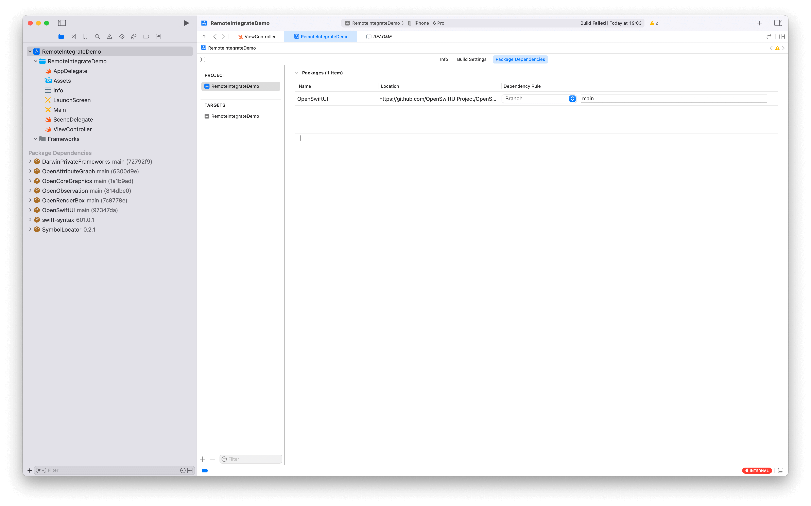
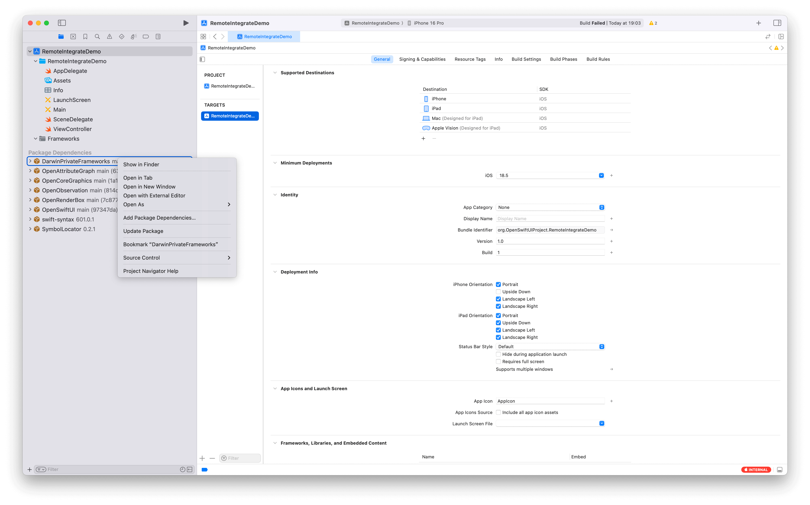
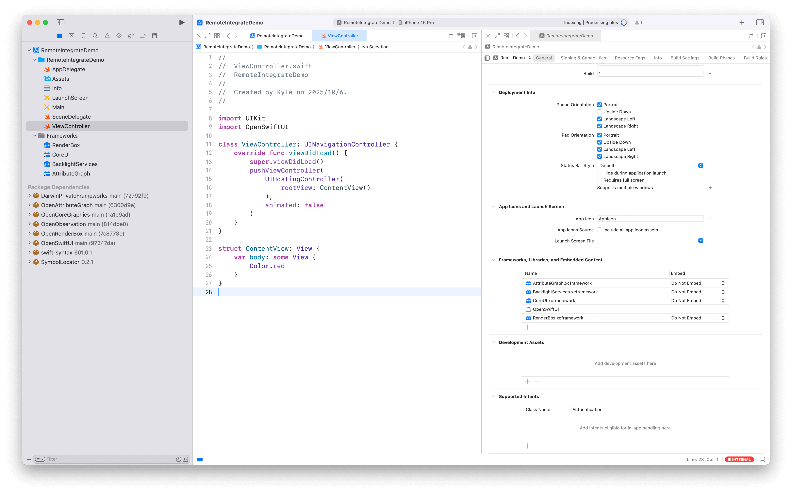

# How to Integrate OpenSwiftUI into Your Project

This guide walks you through the steps to integrate OpenSwiftUI into your Xcode project.

## Prerequisites

- Xcode 16.4
- Swift 6.1.2+
- macOS 15.5 (for macOS apps) or iOS 18.5 (for iOS apps)

## Important Notes

> [!WARNING]
> OpenSwiftUI uses private Apple APIs and frameworks - NOT for App Store distribution.
>
> These private frameworks are ONLY for research and educational purposes.

## Integration Steps for Swift Package:

### Step 1: Add OpenSwiftUI Package Dependency

#### Using Branch or Revision (Recommended)

Due to the use of `unsafeFlags` in the build configuration, you **cannot** use tagged releases (like `0.10.0`). Instead, you must specify either a **branch** or a **revision** dependency.

#### Option A: Using Branch (e.g., main)

Add the following to your `Package.swift`:

```swift
dependencies: [
    .package(url: "https://github.com/OpenSwiftUIProject/OpenSwiftUI.git", branch: "main"),
]
```

#### Option B: Using Revision

To use a specific commit or tag revision:

```swift
dependencies: [
    .package(url: "https://github.com/OpenSwiftUIProject/OpenSwiftUI.git", revision: "97347dadc"),
]
```

You can find the revision hash by checking the commit you want to use on GitHub.

## Integration Steps for Xcode project:

### Step 1: Add OpenSwiftUI Package Dependency

1. In your Xcode project, go to **File → Add Package Dependencies...**
2. Enter the repository URL: `https://github.com/OpenSwiftUIProject/OpenSwiftUI.git`
3. Select "Branch" and enter `main` (or select "Commit" and enter a specific revision)
4. Click **Add Package**



### Step 2: Handle DarwinPrivateFrameworks XCFrameworks

When building for Darwin platforms, you will likely encounter xcframework-related issues. You need to manually add the required private frameworks from DarwinPrivateFrameworks to your target.

> [!NOTE]
> Why This Is Needed?
>
> OpenSwiftUI depends on private frameworks like AttributeGraph that are not publicly available.
>
> The DarwinPrivateFrameworks package provides these as xcframeworks, but they need to be manually configured in Xcode to avoid runtime issues.

#### 1. Locate DarwinPrivateFrameworks

After adding OpenSwiftUI as a dependency, the DarwinPrivateFrameworks package will be downloaded automatically.

In Xcode's Project Navigator:
- Find **Package Dependencies → DarwinPrivateFrameworks**
- Right-click on **DarwinPrivateFrameworks** and select **Show in Finder**



#### 2. Add XCFrameworks to Your Target

In Finder, you'll see the xcframework files (e.g., `AG/2024/AttributeGraph.xcframework`).

**Drag the required xcframework(s)** into your Xcode project's target:
1. Select your app target in Xcode
2. Go to the **General** tab
3. Scroll to **Frameworks, Libraries, and Embedded Content** section
4. Drag the xcframework files from Finder into this section
5. **Important:** Set the embed option to **Do Not Embed**



This tells Xcode to link against the frameworks without embedding them, which is necessary for private SDK usage on macOS.

### Step 3: Add Required Frameworks

The following xcframeworks are typically needed:
- **AttributeGraph.xcframework** - From `AG/2024/` directory
- Other frameworks as needed based on your OpenSwiftUI usage

For more details, see the [DarwinPrivateFrameworks README](https://github.com/OpenSwiftUIProject/DarwinPrivateFrameworks).

## Step 3: Import and Use OpenSwiftUI

In your Swift files, import OpenSwiftUI just like you would import SwiftUI:

```swift
import OpenSwiftUI

struct ContentView: View {
    var body: some View {
        VStack {
            Color.red
            Color.blue
        }
    }
}
```

> NOTE: Only some API and View is supported.

## Platform-Specific Notes

The current supported platforms are macOS and iOS simulators. (visionOS simulator is also supported but not tested extensively and there is no CI for it yet.)

## Known Limitations

### 1. iOS Device Builds Not Supported

Currently, AttributeGraph is missing some symbols for iOS device. Until OpenAttributeGraph is ready, this platform is not supported.

**Affected platforms:**
- iOS device builds (iPhone, iPad)

**Workaround:** Use iOS Simulator for development and testing.

**Future resolution:** This limitation will be lifted when OpenAttributeGraph is ready, which will unlock iOS device platform support.

### 2. ABI Compatibility Requirements

⚠️ **Important:** The current Render engine uses a private API of SwiftUI which does not guarantee ABI stability. Until OpenSwiftUI's ViewUpdater render engine is implemented, it is required to use the same ABI version.

**Current supported ABI versions:**
- **iOS 18.5**
- **macOS 15.5**

**Impact:** Your target platform deployment version must match these specific versions to avoid runtime compatibility issues.

**Future resolution:** This limitation will be lifted when OpenSwiftUI's own Render engine (ViewUpdater) is ready, which will remove the ABI version lock requirement and allow broader platform version support.

## Troubleshooting

### Install Errors Related to the private frameworks

If you see errors like:
```
AttributeGraph.framework has missing or invalid CFBundleExecutable in its Info.plist
```

Make sure you've added the AttributeGraph.xcframework to your target and set it to "Do Not Embed".

### Package Resolution Issues

If Xcode fails to resolve the package:
1. Make sure you're using `branch: "main"` or a specific `revision:` instead of a version tag
2. Try **File → Packages → Reset Package Caches**
3. Clean the build folder (**Shift+Cmd+K**) and rebuild