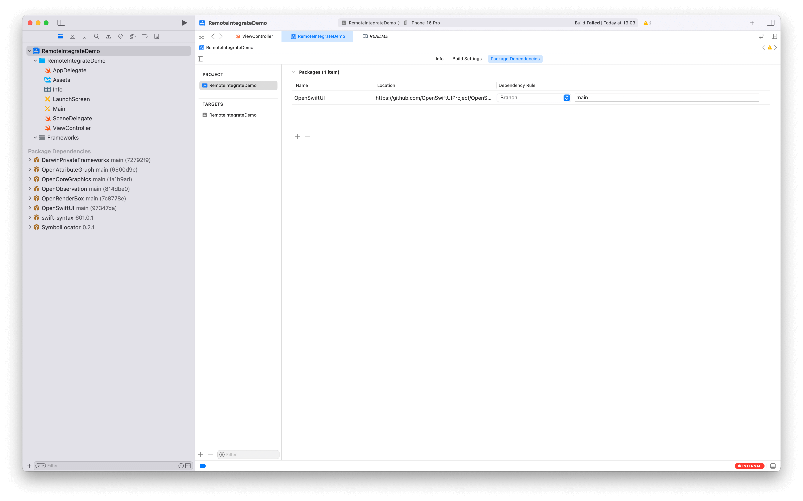
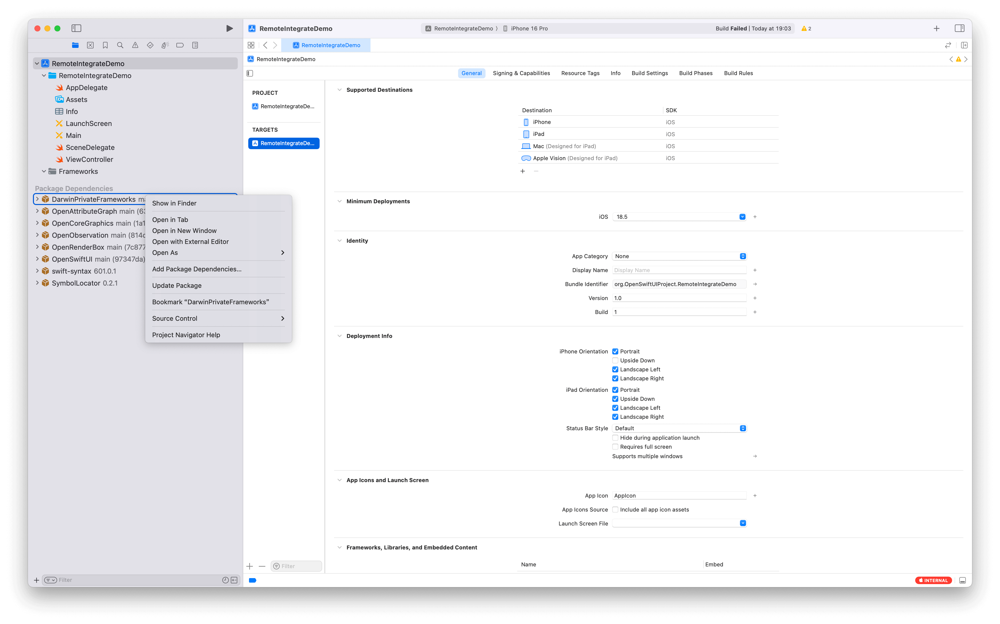
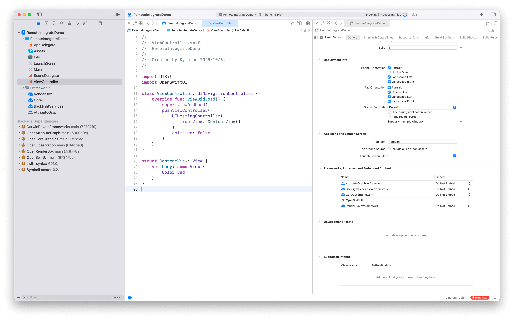

# How to Integrate OpenSwiftUI into Your Project

This guide walks you through the steps to integrate OpenSwiftUI into your Xcode project.

## Prerequisites

- Xcode 16.0+
- Swift 6.1.2+
- macOS 14.0+ (for macOS apps) or iOS 18.0+ (for iOS apps)

## Important Notes

⚠️ **OpenSwiftUI uses private Apple APIs and frameworks - NOT for App Store distribution. These private frameworks are ONLY for research and educational purposes.**

## Step 1: Add OpenSwiftUI Package Dependency

### Using Branch or Revision (Recommended)

Due to the use of `unsafeFlags` in the build configuration, you **cannot** use tagged releases (like `0.10.0`). Instead, you must specify either a **branch** or a **revision** dependency.

#### Option A: Using Branch (e.g., main)

Add the following to your `Package.swift`:

```swift
dependencies: [
    .package(url: "https://github.com/OpenSwiftUIProject/OpenSwiftUI.git", branch: "main"),
]
```

#### Option B: Using Revision

To use a specific commit or tag revision:

```swift
dependencies: [
    .package(url: "https://github.com/OpenSwiftUIProject/OpenSwiftUI.git", revision: "97347dadc"),
]
```

You can find the revision hash by checking the commit you want to use on GitHub.

### In Xcode

1. In your Xcode project, go to **File → Add Package Dependencies...**
2. Enter the repository URL: `https://github.com/OpenSwiftUIProject/OpenSwiftUI.git`
3. Select "Branch" and enter `main` (or select "Commit" and enter a specific revision)
4. Click **Add Package**



## Step 2: Handle DarwinPrivateFrameworks XCFrameworks

When building on macOS, you will likely encounter xcframework-related issues. You need to manually add the required private frameworks from DarwinPrivateFrameworks to your target.

### Why This Is Needed

OpenSwiftUI depends on private frameworks like AttributeGraph that are not publicly available. The DarwinPrivateFrameworks package provides these as xcframeworks, but they need to be manually configured in Xcode to avoid runtime issues.

### Manual Setup Instructions

#### 1. Locate DarwinPrivateFrameworks

After adding OpenSwiftUI as a dependency, the DarwinPrivateFrameworks package will be downloaded automatically.

In Xcode's Project Navigator:
- Find **Package Dependencies → DarwinPrivateFrameworks**
- Right-click on **DarwinPrivateFrameworks** and select **Show in Finder**



#### 2. Add XCFrameworks to Your Target

In Finder, you'll see the xcframework files (e.g., `AG/2024/AttributeGraph.xcframework`).

**Drag the required xcframework(s)** into your Xcode project's target:
1. Select your app target in Xcode
2. Go to the **General** tab
3. Scroll to **Frameworks, Libraries, and Embedded Content** section
4. Drag the xcframework files from Finder into this section
5. **Important:** Set the embed option to **Do Not Embed**



This tells Xcode to link against the frameworks without embedding them, which is necessary for private SDK usage on macOS.

### Required Frameworks

The following xcframeworks are typically needed:
- **AttributeGraph.xcframework** - From `AG/2024/` directory
- Other frameworks as needed based on your OpenSwiftUI usage

For more details, see the [DarwinPrivateFrameworks README](https://github.com/OpenSwiftUIProject/DarwinPrivateFrameworks).

## Step 3: Import and Use OpenSwiftUI

In your Swift files, import OpenSwiftUI just like you would import SwiftUI:

```swift
import OpenSwiftUI

struct ContentView: View {
    var body: some View {
        Text("Hello, OpenSwiftUI!")
            .padding()
    }
}
```

## Platform-Specific Notes

### macOS Applications

For macOS apps, you must manually add and configure the xcframeworks as described in Step 2. Set them to **Do Not Embed** to avoid issues with private SDK usage.

### iOS Applications (Simulator)

For iOS Simulator builds, the xcframework configuration may also be required. Follow the same steps as macOS.

### iOS Device Builds

iOS device builds may require additional configuration. Refer to the DarwinPrivateFrameworks documentation for device-specific instructions.

## Troubleshooting

### Build Errors Related to AttributeGraph

If you see errors like:
```
dyld: Library not loaded: @rpath/AttributeGraph.framework/AttributeGraph
```

Make sure you've added the AttributeGraph.xcframework to your target and set it to "Do Not Embed".

### Package Resolution Issues

If Xcode fails to resolve the package:
1. Make sure you're using `branch: "main"` or a specific `revision:` instead of a version tag
2. Try **File → Packages → Reset Package Caches**
3. Clean the build folder (**Shift+Cmd+K**) and rebuild

### Unsupported Platform

OpenSwiftUI currently supports:
- macOS 14.0+
- iOS 18.0+

Other platforms (watchOS, tvOS, visionOS) have limited or no support at this time.

## Additional Resources

- [OpenSwiftUI GitHub](https://github.com/OpenSwiftUIProject/OpenSwiftUI)
- [DarwinPrivateFrameworks](https://github.com/OpenSwiftUIProject/DarwinPrivateFrameworks)
- [OpenSwiftUI Documentation](https://github.com/OpenSwiftUIProject/OpenSwiftUI#readme)

## Development and Debugging

For development and debugging purposes, you can also clone the repository and its dependencies locally:

```bash
# Clone OpenSwiftUI
git clone https://github.com/OpenSwiftUIProject/OpenSwiftUI.git
cd OpenSwiftUI

# Clone required dependencies in parent directory
cd ..
git clone https://github.com/OpenSwiftUIProject/OpenAttributeGraph.git
git clone https://github.com/OpenSwiftUIProject/OpenRenderBox.git
git clone https://github.com/OpenSwiftUIProject/DarwinPrivateFrameworks.git

# Return to OpenSwiftUI and build
cd OpenSwiftUI
./Scripts/build.sh
```

See [CLAUDE.md](CLAUDE.md) for more development details.
